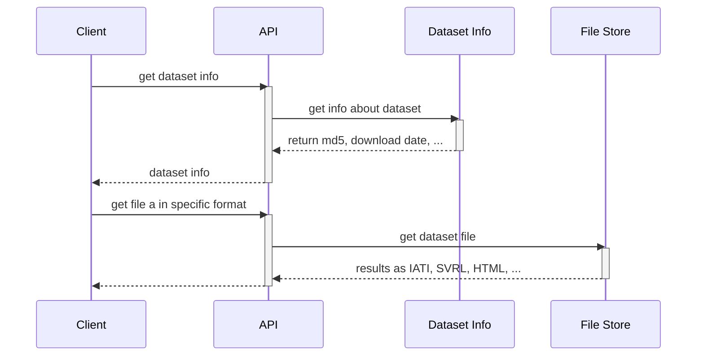
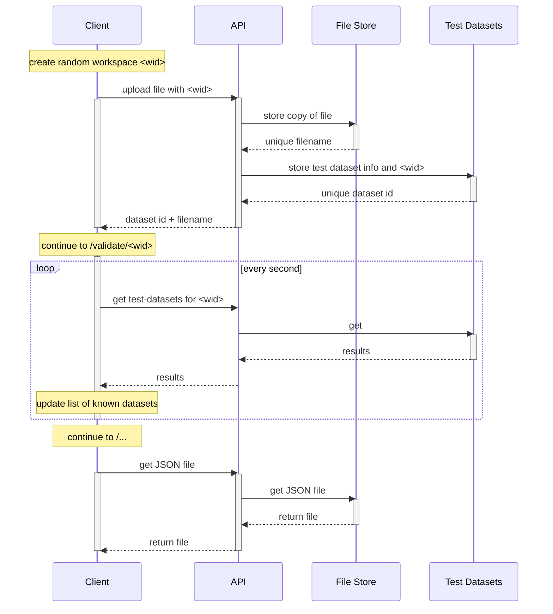

The IATI data validator API provides access to a store of IATI data files and their validations. It is still in development, so the architecture and APIs may change.

The validator API and services run as a set of Kubernetes pods on a cluster. It is currently tailored to (and running on) the [Google Kubernetes Engine](https://cloud.google.com/kubernetes-engine/).

## Architecture

### API on public files

The API runs behind a load balancer, and interfaces with both the file store and the dataset information database.

At the moment, the API requires a two-step approach:

- Get dataset information about a specific publisher, dataset, or download URL. This will include an MD5 checksum of the dataset source file.
- Download the required result format of the validation as a file, based on the MD5 checksum.

### API on unpublished files

To be developed:

- Provide an interface to upload a file or URL.
- Check of MD5 of file has been processed already
- Process the specific file and return the results.
- Clean up the results after a period (API storage?).

### Data Refresher

The data refresher is run regularly:

- It checks all available datasets at the IATI Registry
- It downloads all files as a snapshot, and updates a repository with archived versions.
- It triggers the Validation Engine to process all new files. If the Validation Engine itself is updated, all files will be re-validated.
- It uploads the new files into the File Store, and updates the information about available datasets in the Dataset Info database.

Thanks
------

Tools used to run the engine, to style the output, or to create or process the sources or documentation.

| Run                                         | Style                                                        | Make                                          |
| ------------------------------------------- | ------------------------------------------------------------ | --------------------------------------------- |
| [NodeJS](https://nodejs.org)                | [Twitter Bootstrap](https://getbootstrap.com)                | [Atom editor](https://atom.io/) and plugins   |
| [Loopback](http://loopback.io/)             | [Fuelux extension](http://getfuelux.com)                     | [Typora markdown editor](https://typora.io/)  |
| [Docker containers](https://www.docker.com) | [Flatly theme from Bootswatch](https://bootswatch.com/flatly) | [Jekyll](https://jekyllrb.com)                |
| [Kubernetes](https://kubernetes.io)         |                                                              | [Github and Github Pages](https://github.com) |

