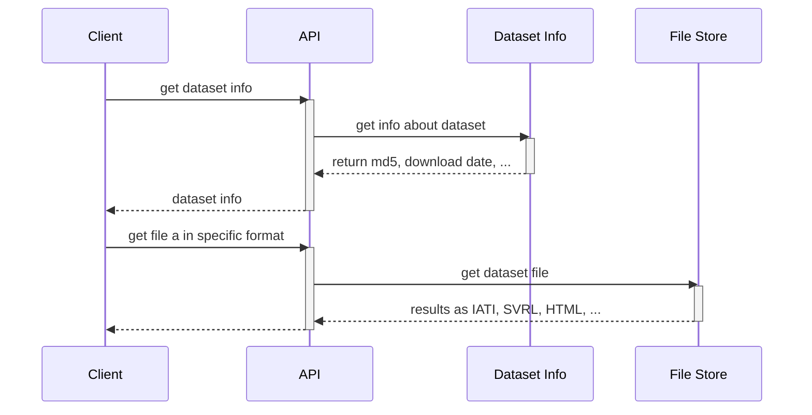

### API on public files

The API runs behind a load balancer, and interfaces with both the file store and the dataset information database.

At the moment, the API requires a two-step approach:

- Get dataset information about a specific publisher, dataset, or download URL. This will include an MD5 checksum of the dataset source file.
- Download the required result format of the validation as a file, based on the MD5 checksum.

