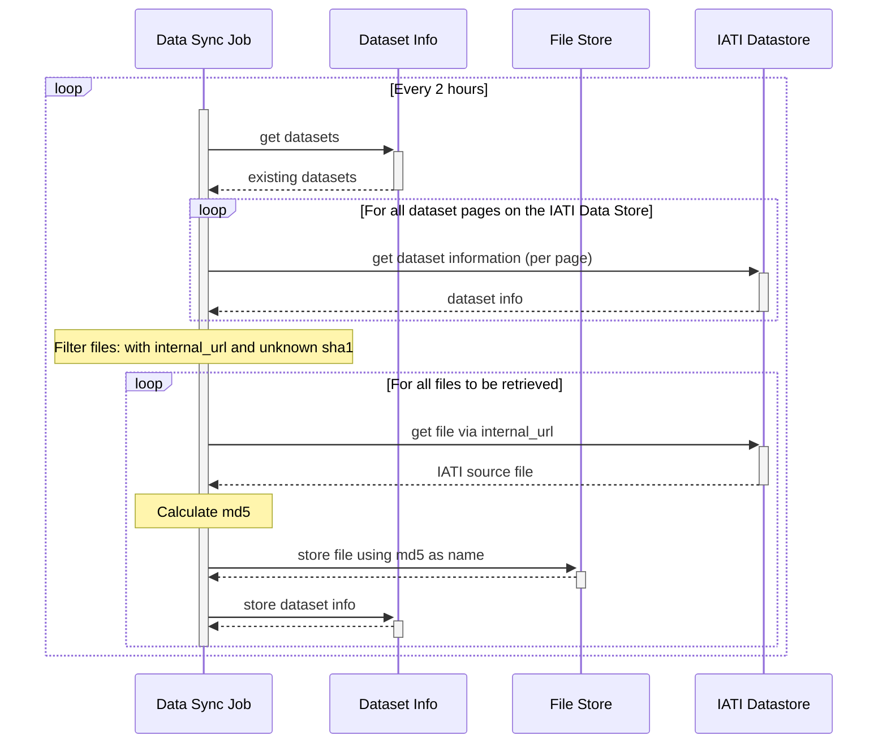
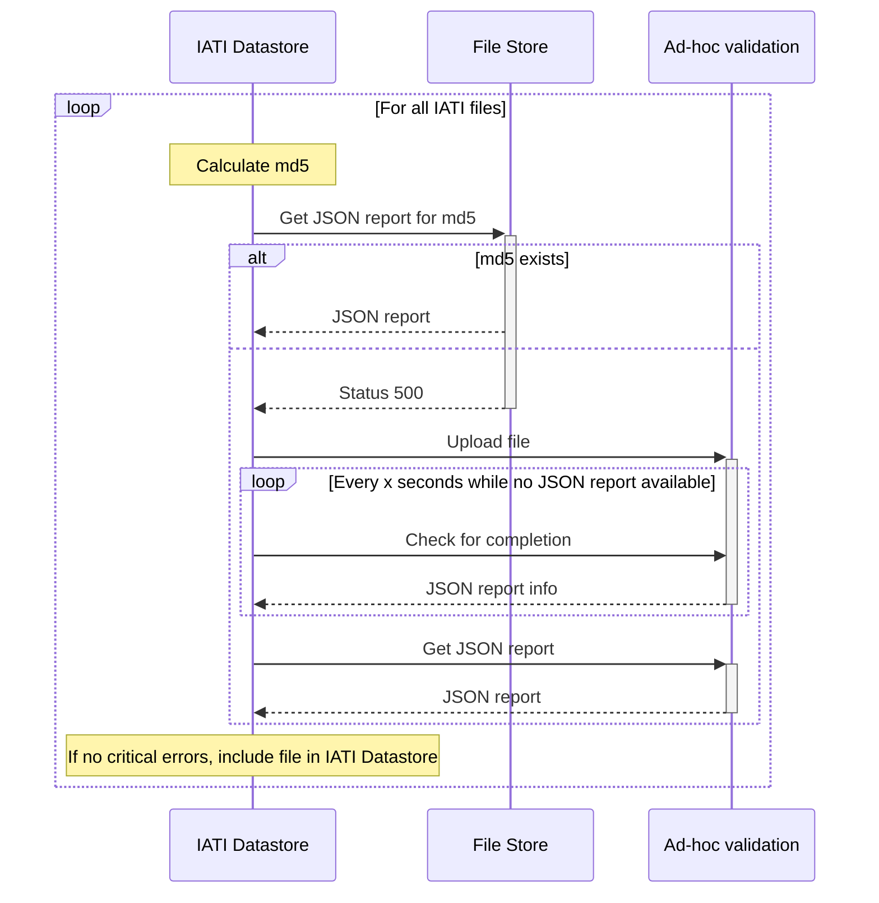

The IATI Datastore synchronisation consists of several parts:

* An update job to load information from the IATI Registry about publishers and datasets.
* A data refresher job to download files from the IATI Datastore.
* A data validation service that processes IATI files and generates validation reports.
* A janitor job to remove obsolete files and datasets from the system.

The update job and janitor job currently run in separate containers with a different stack.

## Data Refresher

The synchronisation with the Datastore is done by running the API container with environment variables to schedule the synchronisation job.

## Datastore

The IATI Datastore updates the data using the pre-compiled validation reports where available, and asking for ad-hoc validation if there is no pre-compiled validation report.

