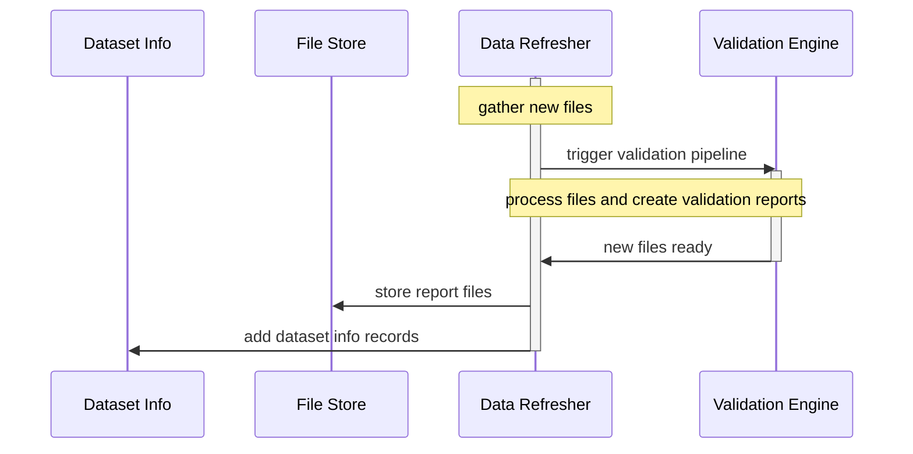

### Data Refresher

The data refresher is run regularly:

- It checks all available datasets at the IATI Registry
- It downloads all files as a snapshot, and updates a repository with archived versions.
- It triggers the Validation Engine to process all new files. If the Validation Engine itself is updated, all files will be re-validated.
- It uploads the new files into the File Store, and updates the information about available datasets in the Dataset Info database.

